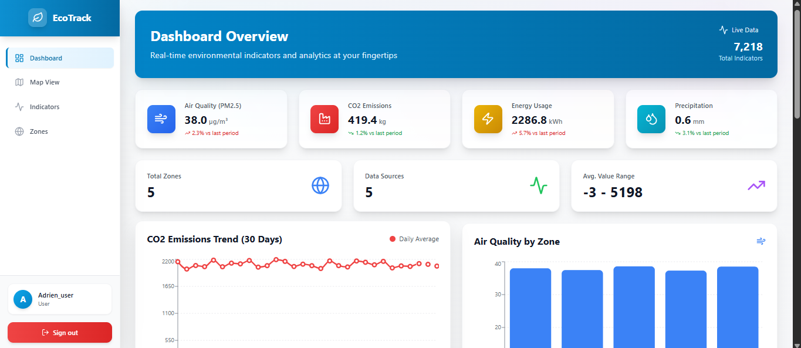

# EcoTrack API

API FastAPI pour le suivi d'indicateurs environnementaux locaux avec interface web moderne.


## 🚀 Vue d'ensemble

EcoTrack est une application complète de suivi environnemental qui permet de collecter, analyser et visualiser des indicateurs environnementaux (qualité de l'air, CO₂, météo, énergie). L'application comprend une API REST sécurisée avec FastAPI et un dashboard web interactif développé avec React.

## ✨ Fonctionnalités principales

### 🔐 Authentification et sécurité
- **Authentification JWT** avec gestion des rôles (user/admin)
- **Système de permissions** granulaire pour chaque fonctionnalité
- **Inscription publique** pour les utilisateurs réguliers
- **Gestion des sessions** sécurisée

### 📊 Dashboard interactif
- **Vue d'ensemble en temps réel** avec statistiques clés
- **Graphiques interactifs** (lignes, barres, aires, camemberts)
- **Mise à jour automatique** toutes les 30 secondes
- **Design moderne** avec Tailwind CSS

### 🗺️ Visualisation cartographique
- **Carte interactive** avec Leaflet
- **Visualisation des zones** avec indicateurs
- **Filtrage par type d'indicateur**
- **Popups informatifs** avec détails par zone

### 📈 Gestion des données
- **CRUD complet** pour indicateurs, zones et sources
- **Filtrage avancé** par date, zone et type
- **Tri et pagination** pour grandes quantités de données
- **Export et visualisation** des données

### 👥 Gestion des utilisateurs
- **Panel d'administration** pour gérer les utilisateurs
- **Création de comptes admin** par les administrateurs
- **Activation/désactivation** de comptes
- **Gestion des rôles** (user/admin)

### 📥 Ingestion de données
- **Intégration avec Open-Meteo** (données météo gratuites)
- **Intégration avec OpenAQ** (qualité de l'air)
- **Génération de données de test** pour le développement
- **Scripts automatisés** pour l'ingestion régulière

## 📸 Aperçu de l'application

### Page de connexion

Interface de connexion sécurisée avec authentification JWT.

### Dashboard principal

Vue d'ensemble avec statistiques en temps réel, graphiques interactifs et indicateurs récents.

### Dashboard utilisateur

Interface utilisateur avec accès en lecture seule aux données et visualisations.

### Page des indicateurs

Gestion complète des indicateurs environnementaux avec filtres, tri et pagination. Les utilisateurs réguliers peuvent consulter, les admins peuvent créer, modifier et supprimer.

### Page des zones

Gestion des zones géographiques avec coordonnées et codes postaux. Visualisation et édition pour les administrateurs.

### Gestion des utilisateurs (Admin)

Panel d'administration pour gérer les utilisateurs, créer des admins, modifier les rôles et activer/désactiver des comptes.

## 📦 Installation

### Prérequis
- Python 3.8+
- Node.js 16+
- npm ou yarn

### Backend (API)

1. **Créer un environnement virtuel:**
```bash
python -m venv venv
source venv/bin/activate  # Sur Windows: venv\Scripts\activate
```

2. **Installer les dépendances:**
```bash
pip install -r requirements.txt
```

3. **Créer le premier admin:**
```bash
python init_admin.py
```
Suivez les instructions pour créer votre compte administrateur.

4. **Lancer le serveur:**
```bash
uvicorn app.main:app --reload
```

L'API sera accessible sur `http://localhost:8000`

### Frontend (Dashboard)

1. **Aller dans le dossier frontend:**
```bash
cd frontend
```

2. **Installer les dépendances:**
```bash
npm install
```

3. **Installer les dépendances pour la carte (si nécessaire):**
```bash
npm install leaflet react-leaflet
```

4. **Lancer le serveur de développement:**
```bash
npm run dev
```

Le frontend sera accessible sur `http://localhost:5173`

## 📚 Documentation

- **API Swagger UI**: `http://localhost:8000/docs` - Documentation interactive de l'API
- **API ReDoc**: `http://localhost:8000/redoc` - Documentation alternative de l'API
- **Frontend Dashboard**: `http://localhost:5173` - Interface web
- **Ingestion de données**: Voir `ingestion/README.md` pour les scripts d'ingestion

## 👥 Gestion des Rôles

### Utilisateurs Réguliers (role="user")
- ✅ Accès au **Dashboard** avec statistiques et graphiques
- ✅ Accès à la **Vue cartographique** pour visualiser les zones
- ✅ **Consultation** des indicateurs environnementaux
- ✅ **Consultation** des zones géographiques
- ✅ Filtrage et tri des données en lecture seule
- ❌ **NE PEUVENT PAS** créer, modifier ou supprimer des données
- ❌ **NE PEUVENT PAS** gérer d'autres utilisateurs

### Administrateurs (role="admin")
- ✅ Tous les droits des utilisateurs réguliers
- ✅ **Gestion complète des utilisateurs**:
  - Voir tous les utilisateurs
  - Créer d'autres administrateurs
  - Activer/désactiver des comptes
  - Changer les rôles
  - Supprimer des utilisateurs
- ✅ **Gestion complète des données**:
  - Créer, modifier et supprimer des indicateurs
  - Créer, modifier et supprimer des zones
  - Gérer les sources de données
  - Accès à toutes les fonctionnalités CRUD

### Création de Comptes

- **Inscription publique** (`/register`): Crée uniquement des comptes **user**
- **Création d'admin**: Seuls les admins peuvent créer d'autres admins via le dashboard

## 📁 Structure du projet

```
.
├── app/
│   ├── main.py              # Point d'entrée FastAPI
│   ├── models.py            # Modèles SQLAlchemy
│   ├── schemas.py           # Schémas Pydantic
│   ├── crud.py              # Opérations base de données
│   ├── auth.py              # Authentification JWT
│   ├── database.py          # Configuration DB
│   └── routers/             # Endpoints API
│       ├── auth.py          # Inscription/Connexion
│       ├── users.py         # Gestion utilisateurs (admin)
│       ├── zones.py         # Gestion zones
│       ├── indicators.py    # Gestion indicateurs
│       ├── sources.py       # Gestion sources
│       └── stats.py         # Statistiques
├── frontend/
│   ├── src/
│   │   ├── pages/           # Pages React
│   │   │   ├── Login.jsx
│   │   │   ├── Register.jsx
│   │   │   ├── Dashboard.jsx
│   │   │   ├── Map.jsx
│   │   │   ├── Indicators.jsx
│   │   │   ├── Zones.jsx
│   │   │   └── Users.jsx    # Admin only
│   │   ├── layouts/         # Layouts
│   │   ├── context/        # Context API (Auth)
│   │   └── api/             # Configuration API
│   └── package.json
├── ingestion/               # Scripts d'ingestion
│   ├── openmeteo_ingestion.py
│   ├── openaq_ingestion.py
│   ├── mock_data_ingestion.py
│   └── README.md
├── app_screenshots/         # Captures d'écran
├── tests/                   # Tests
├── init_admin.py            # Script création admin
└── requirements.txt
```

## 🎯 Utilisation

### 1. Créer le premier admin
```bash
python init_admin.py
```

### 2. Se connecter au dashboard
1. Ouvrir `http://localhost:5173`
2. Se connecter avec les identifiants admin
3. Accéder aux fonctionnalités dans la sidebar

### 3. Créer d'autres admins (Admin uniquement)
1. Aller dans "Users" dans la sidebar
2. Cliquer sur "Create Admin"
3. Remplir le formulaire

### 4. Ingérer des données
```bash
# Données météo (gratuit, sans clé API)
python ingestion/openmeteo_ingestion.py

# Données de test
python ingestion/mock_data_ingestion.py --days 30

# Données qualité air (nécessite clé API OpenAQ)
python ingestion/openaq_ingestion.py
```

Voir `ingestion/README.md` pour plus de détails.

## 🔌 API Endpoints

### Authentification
- `POST /auth/register` - Inscription (crée un user)
- `POST /auth/login` - Connexion (retourne JWT)

### Utilisateurs (Admin uniquement)
- `GET /users/` - Liste des utilisateurs
- `GET /users/me` - Utilisateur courant
- `PUT /users/{id}` - Modifier utilisateur
- `DELETE /users/{id}` - Supprimer utilisateur

### Indicateurs
- `GET /indicators/` - Liste avec filtres (tous les utilisateurs)
- `POST /indicators/` - Créer (admin)
- `PUT /indicators/{id}` - Modifier (admin)
- `DELETE /indicators/{id}` - Supprimer (admin)

### Zones
- `GET /zones/` - Liste des zones (tous les utilisateurs)
- `POST /zones/` - Créer (admin)
- `PUT /zones/{id}` - Modifier (admin)
- `DELETE /zones/{id}` - Supprimer (admin)

### Sources
- `GET /sources/` - Liste des sources
- `POST /sources/` - Créer (admin)
- `PUT /sources/{id}` - Modifier (admin)
- `DELETE /sources/{id}` - Supprimer (admin)

### Statistiques
- `GET /stats/summary` - Résumé global
- `GET /stats/air/averages` - Moyennes qualité air
- `GET /stats/co2/trend` - Tendance CO2

## ✅ Fonctionnalités implémentées

- [x] Backend API avec authentification JWT
- [x] Frontend Dashboard React moderne
- [x] Gestion des rôles (user/admin) avec permissions granulaires
- [x] Admin panel complet
- [x] Ingestion de données externes (Open-Meteo, OpenAQ)
- [x] Vue cartographique interactive avec Leaflet
- [x] Statistiques et visualisations avec Recharts
- [x] CRUD complet pour toutes les entités
- [x] Filtrage, tri et pagination avancés
- [x] Interface responsive et moderne
- [x] Mise à jour automatique des données

## 🎨 Technologies utilisées

### Backend
- **FastAPI** - Framework web moderne et rapide
- **SQLAlchemy** - ORM pour la base de données
- **Pydantic** - Validation des données
- **JWT** - Authentification sécurisée
- **SQLite** - Base de données (peut être remplacée par PostgreSQL)

### Frontend
- **React** - Bibliothèque UI
- **React Router** - Navigation
- **Tailwind CSS** - Framework CSS
- **Recharts** - Graphiques et visualisations
- **Leaflet** - Cartes interactives
- **Axios** - Client HTTP
- **Lucide React** - Icônes

## 🔒 Sécurité

⚠️ **IMPORTANT**: Avant de déployer en production:
1. Changer `SECRET_KEY` dans `app/auth.py`
2. Utiliser une vraie base de données (PostgreSQL)
3. Configurer CORS correctement
4. Activer HTTPS
5. Utiliser des variables d'environnement pour les secrets
6. Implémenter un système de rate limiting
7. Ajouter des logs de sécurité

## 📝 Notes

- La base de données SQLite est créée automatiquement au premier lancement
- Les données d'ingestion peuvent être ajoutées via les scripts dans `ingestion/`
- Le dashboard se met à jour automatiquement toutes les 30 secondes
- Les utilisateurs réguliers peuvent consulter toutes les données mais ne peuvent pas les modifier
- Les admins ont accès complet à toutes les fonctionnalités de gestion

## 🤝 Contribution

Ce projet a été développé dans le cadre d'un projet académique. Pour toute question ou suggestion, n'hésitez pas à ouvrir une issue.

## 📄 Licence

Ce projet est développé à des fins éducatives.

---

**EcoTrack** - Suivi environnemental intelligent 🌱
